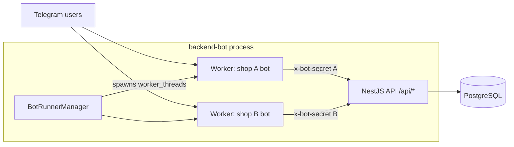

# Telegram Shop Bot (bot runner)

Telegram storefront for DigitalShop. The bot is a thin UI layer built with
[Telegraf](https://telegraf.js.org/): every business action (products, orders,
payments, wallet, coupons, points, referrals) is delegated to the
**backend-bot** API over HTTP, authenticated with a per-shop secret.

## Architecture



- **One worker per shop.** backend-bot's BotRunnerManager polls
  `telegram_bots`; each ACTIVE bot gets its own `worker_threads` instance of
  this runner with per-shop env (token, shop name, support URL, secret).
- **Per-shop scoping.** The runner sends `x-bot-secret`; backend-bot resolves
  the shop from the secret hash and scopes every query (products, orders,
  balances, coupons, points, referrals) to that shop.
- **No local state.** The runner keeps no database; the only in-memory state is
  the per-user UI state (current checkout step) and language cache.

## Features

- Product catalog with variants, per-language names, stock display
- Checkout: quantity, coupon (enter code or pick from wallet), payment method
- Payments per shop: Binance Pay (USDT), bank transfer via SePay (VND, QR),
  wallet balance (USDT / VND)
- Wallet topup (Binance / bank) with automatic confirmation polling
- Order history with tabs (completed / pending / cancelled) and order detail
- Coupons: my coupons, coupon shop (redeem with points)
- Loyalty: daily check-in, referral program with deep links (`?start=ref_CODE`)
- 4 languages: English, Vietnamese, Russian, Chinese (synced to backend)

## Running

### Production

Nothing to run here. backend-bot bundles this runner (`BOT_RUNNER_DIR`) and
starts/stops one worker per shop when sellers toggle the bot in admin
Settings. All per-shop variables are injected from the database
(`telegram_bots`, `shops`, `shop_payment_credentials`).

### Development (single instance)

```bash
npm install
cp .env.example .env   # fill in values below
npm start              # or: npm run dev (auto-reload)
```

```env
# Per-shop (injected in production)
BOT_TOKEN=your_telegram_bot_token_from_botfather
BOT_USERNAME=your_bot_username
SHOP_NAME=Your Shop Name
SUPPORT_URL=https://t.me/your_support_username
BANK_ENABLED=true

# backend-bot connection (no /api suffix)
BACKEND_API_BASE_URL=http://localhost:3001
BACKEND_BOT_SECRET=change-this-secret
BACKEND_REQUEST_TIMEOUT_MS=8000
```

`BACKEND_BOT_SECRET` must match the secret stored for the shop's bot in
`telegram_bots` (created in admin Settings).

## Project structure

```
src/
├── bot.js                     # Entry point: Telegraf setup, command registration
├── config.js                  # Env loader (per-shop values injected by manager)
├── handlers/
│   ├── commands.js            # /start /balance /daily /referral /history /lang /myid
│   ├── callbacks.js           # Inline button router + screen handlers
│   ├── messages.js            # Free-text input (quantity, amount, codes)
│   └── error-middleware.js    # Backend API error extraction
├── services/                  # HTTP clients for backend-bot API
│   ├── backend-client.js      # Axios factory with x-bot-secret header
│   ├── backend-auth.js        # login / me / language
│   ├── backend-product.js     # product list / detail
│   ├── backend-order.js       # quote / create / pending / cancel / payment / history
│   ├── backend-wallet.js      # topups
│   ├── backend-coupon.js      # my coupons / coupon shop / redeem
│   ├── backend-point.js       # daily check-in
│   ├── backend-referral.js    # referral me / bind
│   ├── bot-language.js        # language sync helper
│   ├── wallet.js              # wallet view model
│   └── referral.js            # referral view model
├── utils/                     # Screen formatting + keyboard builders
└── locales/                   # en / vi / ru / zh string packs
```

## User commands

- `/start` — main menu (also binds referral deep links)
- `/balance` — USDT / VND / point balances and spending stats
- `/daily` (`/checkin`) — daily check-in
- `/referral` — referral code, link, and stats
- `/history` — order history
- `/lang` — language picker
- `/myid` — show your Telegram ID

## Shop administration

The bot has no in-chat admin commands. Sellers manage everything in the
**admin panel** (`admin-frontend` + `admin-backend`): products/stock, orders,
customers, coupons, payment credentials, bot on/off, support link.

Business configuration lives in the backend, not in the runner's env:

- **Referral & daily login** — backend-bot env (`REFERRAL_REFERRER_BONUS`,
  `REFERRAL_REFEREE_BONUS`, `DAILY_LOGIN_POINTS_REWARD`,
  `DAILY_LOGIN_TIMEZONE`); the bot only displays what the backend returns.
- **Payment methods** — per-shop credentials in admin Settings
  (`shop_payment_credentials`); `BANK_ENABLED` is injected by BotRunnerManager
  based on the BANK credential status.
- **Order/topup timeouts** — decided by the backend (`expires_at`,
  `seconds_left` in responses).

## Checks

```bash
npm run lint                # eslint
npm run check:consistency   # forbidden code patterns
npm run check:locales       # every t('key') exists in all 4 locales, no orphans
```

## Troubleshooting

- **Bot not responding** — check `BOT_TOKEN`, and that only one instance uses
  the token (Telegram allows a single long-polling consumer).
- **API errors** — check `BACKEND_API_BASE_URL` (no `/api` suffix) and that
  `BACKEND_BOT_SECRET` matches the shop's bot secret; watch backend-bot logs.
- **Payments not confirmed** — verify the shop's Binance/SePay credentials in
  admin Settings; backend-bot polls gateways in the background.
